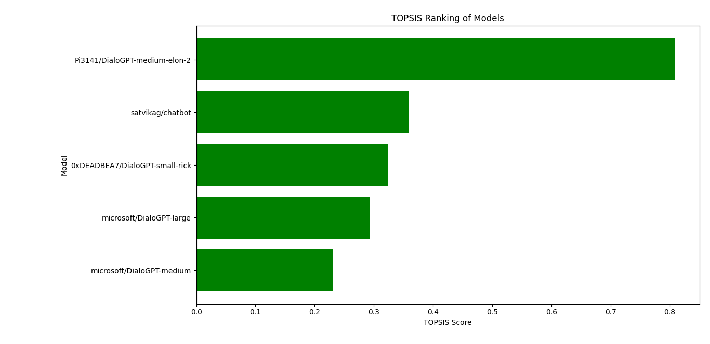

# Overview

This project aims to evaluate the performance of various language models in generating responses to predefined prompts. The models are evaluated based on BLEU and ROUGE scores, as well as response length. Additionally, TOPSIS analysis is performed to rank the models.

## Project Structure

- **Evaluation Script:** The main script (`102103624_pretrained-Topsis.py`) contains the code for evaluating the language models using BLEU, ROUGE, and TOPSIS analysis.
- **Results:** The results of the evaluation are stored in CSV files (`results.csv` and `topsis.csv`).
- **Graphs:** Bar graphs comparing TOPSIS scores and individual metrics (BLEU, ROUGE-1, ROUGE-2, ROUGE-L, and Response Length) are saved as PNG files.

## Usage

1. Install the required dependencies:

pip install torch transformers nltk rouge-score pandas matplotlib numpy

2. Run the evaluation script:

python 102103624_pretrained-Topsis.py

This script evaluates language models, performs TOPSIS analysis, and generates comparison graphs.

3. Review Results:

The results of the evaluation are saved in `results.csv` and `topsis.csv`. Bar graphs comparing TOPSIS scores and individual metrics are saved as PNG files.

## File Descriptions

- `102103624_pretrained-Topsis.py`: Main script for evaluating language models and performing analysis.
- `results.csv`: CSV file containing detailed evaluation results.
- `topsis.csv`: CSV file containing TOPSIS analysis results.
- `Topsis_Ranking.png`: Bar graph visualizing TOPSIS scores.
- `ROUGE-1_comparison.png`, `ROUGE-2_comparison.png`, `ROUGE-L_comparison.png`, `Response Length_comparison.png`, `Response Length.png`: Bar graphs comparing individual metrics.

## Dependencies

- `torch`: PyTorch library for deep learning.
- `transformers`: Hugging Face Transformers library for pre-trained language models.
- `nltk`: Natural Language Toolkit for BLEU score calculation.
- `rouge-score`: Library for ROUGE score calculation.
- `pandas`: Data manipulation library.
- `matplotlib`: Plotting library.
- `numpy`: Numerical computing library.

## Results

### Result Table

| Models                              | BLEU | ROUGE-1       | ROUGE-2       | ROUGE-L       | Response Length | TOPSIS Score | Rank |
|-------------------------------------|------|---------------|---------------|---------------|-----------------|--------------|------|
| microsoft/DialoGPT-medium           | 0    | 0.266323232   | 0.080745342   | 0.218511785   | 8               | 0.231507532  | 5    |
| Pi3141/DialoGPT-medium-elon-2       | 0    | 0.246753634   | 0.067281106   | 0.179064954   | 16.2            | 0.809509469  | 1    |
| 0xDEADBEA7/DialoGPT-small-rick      | 0    | 0.271878788   | 0.080745342   | 0.22369697    | 10              | 0.32355204   | 3    |
| satvikag/chatbot                    | 0    | 0.244006761   | 0.080745342   | 0.206684246   | 10              | 0.359406464  | 2    |
| microsoft/DialoGPT-large            | 0    | 0.258501792   | 0.063865546   | 0.216695341   | 10.6            | 0.292625802  | 4    |

